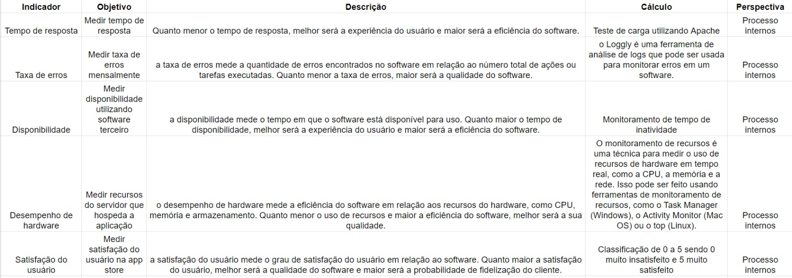
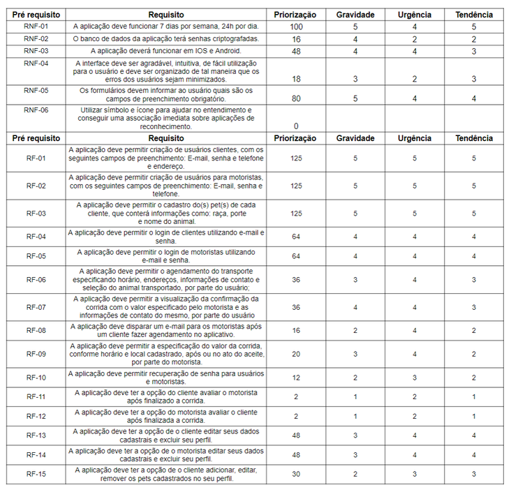
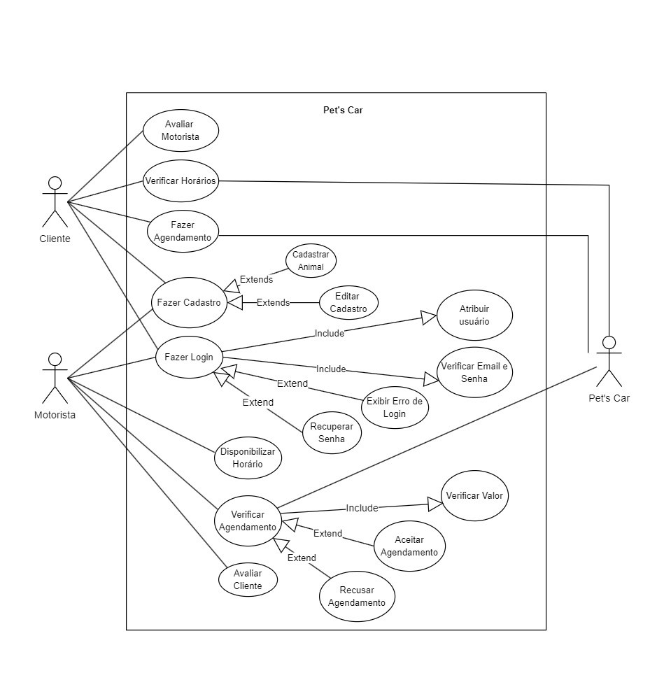
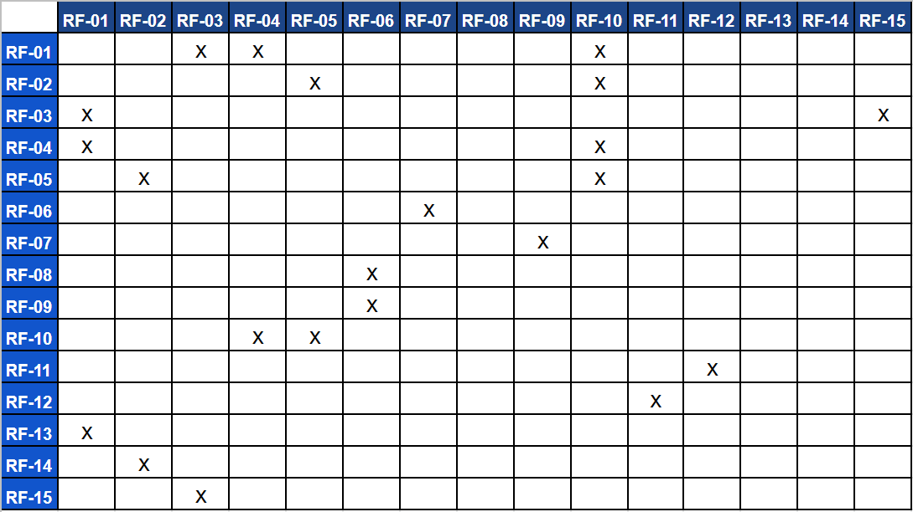
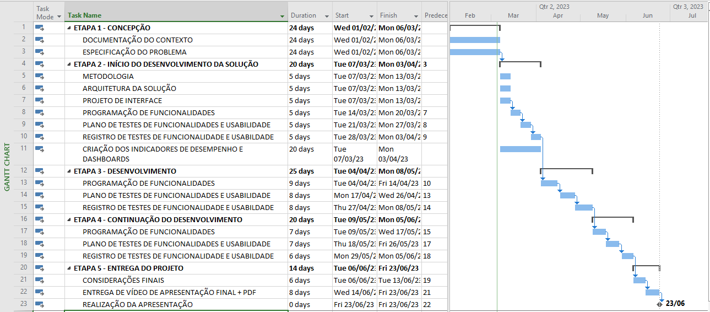
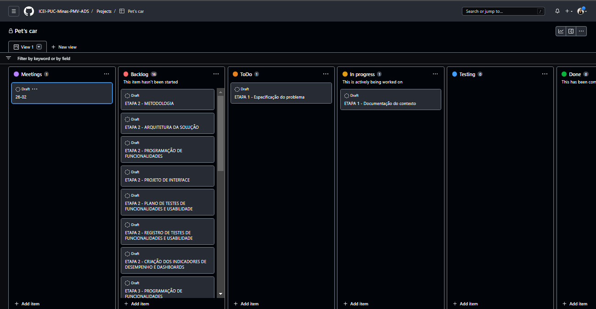
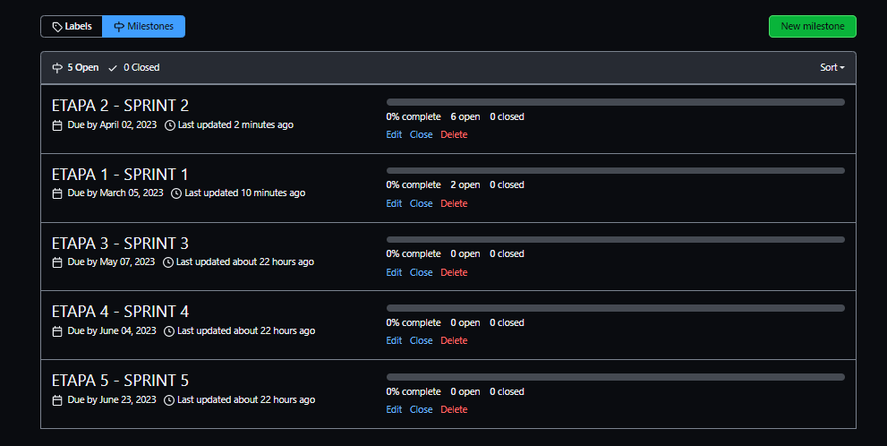
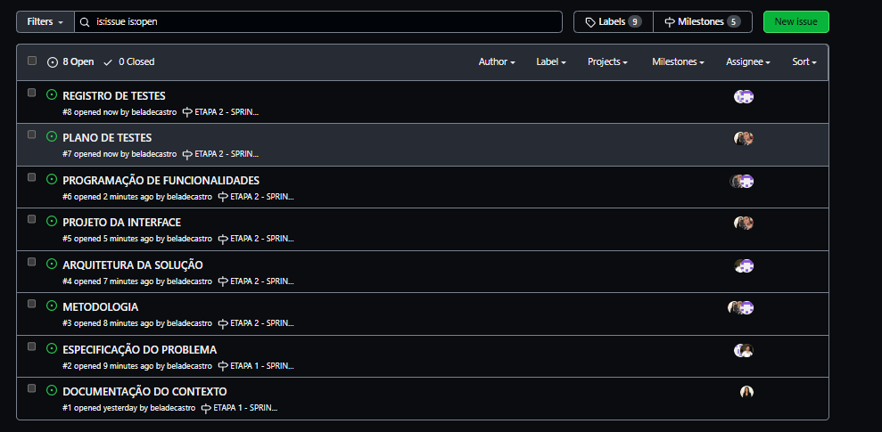
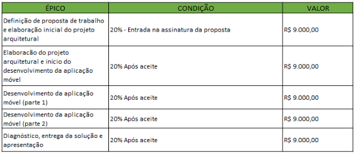
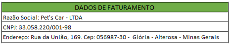

# Especificações do Projeto

Por meio da técnica de observação e brainstorming foram analisadas as necessidades dos usuários do sistema de forma a atender suas demandas.

A partir das informações coletadas, foram determinadas as personas e histórias de usuários que serão de suma importância para a definição das funcionalidades.

## Personas

As personas, ou seja, os usuários ideais do site foram definidos abaixo:

### Pedro

- Pedro tem 19 anos, mora em Alterosa e possui um cachorro da raça Golden.
- Pedro quer utilizar os serviços de um pet shop para dar banho em seu cachorro, pois ele acha difícil fazer por si mesmo, devido ao tamanho do cachorro.
- Ele não possui meio de transporte próprio.
- Pedro entrou em contato com o pet shop e a atendente informou que no momento eles não possuem meio de transporte para buscar o animal.
- Pedro resolve utilizar serviços de transporte particular como a Uber, mas percebe que alguns motoristas não aceitam animais em seu carro.

### Cristiana

- Cristiana tem 24 anos, mora em Alterosa e possui um gato.
- Ela se encontra em uma situação complicada pois seu gato necessita realizar um tratamento em uma clínica veterinária.
- Cristiana possui uma moto, utilizada geralmente para ir ao trabalho.
- Ela tem a ideia de procurar algum aplicativo que faça o transporte adequado de animais, porém não obteve êxito.

### Priscila

- Priscila tem 29 anos e mora em Alterosa.
- Ela trabalha como motorista para a empresa Pet’s Car.
- Priscila precisa ter a opção de recusar ou confirmar os agendamentos de seus clientes de acordo com sua disponibilidade.
- Ela tem a necessidade de saber quais horários e locais precisa buscar os pet’s de seus clientes para se organizar durante seu expediente.

### Vinícius

- Vinícius tem 30 anos, mora em Alterosa e atua como motorista a 8 anos.
- Ele atualmente trabalha para a empresa Pet’s Car.
- Vinícius ao informar para seu cliente que está disponível para fazer o transporte do pet, também tem a necessidade de informar o custo final do serviço.
- Vinícius ao finalizar o serviço deve registrar que o mesmo foi finalizado, e se possível realizar a avaliação do seu cliente.

## Histórias de Usuários

Com a observação do cotidiano das personas e a compreensão de suas necessidades, foram definidas as seguintes histórias de usuários.

| EU COMO... `PERSONA` | QUERO/PRECISO ... `FUNCIONALIDADE`                                                        | PARA ... `MOTIVO/VALOR`                                       |
| -------------------- | ----------------------------------------------------------------------------------------- | ------------------------------------------------------------- |
| Pedro                | Realizar o seu cadastro e login no aplicativo                                             | Poder realizar o agendamento do transporte de seu pet         |
| Cristiana            | Cadastrar seu gato no aplicativo                                                          | Facilmente selecionar os pets que deseja agendar o transporte |
| Vinícius             | Fazer seu cadastro e login no aplicativo da empresa                                       | Acompanhar os agendamentos                                    |
| Pedro                | Realizar o agendamento do transporte do seu cachorro para o Petshop                       | Possa ir trabalhar sem se preocupar em se atrasar             |
| Priscila             | Visualizar, em forma de lista, os agendamentos de transporte disponíveis para confirmação | Escolher e confirmar o agendamento com o cliente              |
| Priscila             | Retorno da aplicação com a confirmação do agendamento com o valor da corrida              | Poder saber que sua corrida foi aceita                        |
| Vinícius             | Ser informado por e-mail que possuí agendamento feito por clientes                        | Confirmar rapidamente a corrida solicitada                    |
| Vinícius             | Informar o valor da corrida para o cliente                                                | Ambas as partes estarem cientes do custo                      |
| Cristiana            | Alterar sua senha de usuário                                                              | Conseguir realizar o login, pois esqueceu a antiga senha      |
| Cristiana            | Avaliar a corrida do motorista e seu cuidado com sua gata                                 | Ajudar a outras pessoas se sentirem seguras ao enviar seu pet |
| Priscila             | Ter a opção de avaliar seu cliente em relação a educação e pontualidade                   | Os clientes ficarem atentos aos seus atos                     |
| Pedro                | Editar seus dados cadastrais                                                              | Atualizar seu novo endereço e e-mail                          |
| Vinícius             | Fazer alterações em seus dados cadastrais                                                 | Concertar o e-mail que utilizou no cadastro                   |
| Cristiana            | Adicionar, editar ou remover o pet cadastrado em seu perfil do aplicativo                 | Ter mais controle do pet em seu perfil                        |

## Modelagem do Processo de Negócio

### Análise da Situação Atual

O aplicativo tem por objetivo tratar o problema de deslocamento de pets utilizando a conveniência de um aplicativo, pagamento fácil e preço acessível. Nos fluxos abaixo explica-se todo o processo de agendamento, cadastro de pets, login e cadastro de motorista ou cliente.

### Descrição Geral da Proposta

### Processo 1 – Processo de Agendamento pelo Cliente

### Processo 2 – Processo da Confirmação do Agendamento pelo Motorista

### Processo 3 – Processo de Cadastrar um novo, editar ou excluir um Pet

### Processo 4 – Editar ou excluir Conta do Usuário

### Processo 5 – Visualizar a avaliação recebida do Cliente ou Motorista

### Processo 6 – Recuperação de Senha

### Processo 7 – Avaliação do Motorista

### Processo 8 – Avaliação do Cliente

## Indicadores de Desempenho

Na tabela abaixo temos indicadores de desempenho utilizados no projeto:

## Requisitos

No projeto, sua estrutura e suas funções são determinadas a partir dos requisitos funcionais e não-funcionais.

Os requisitos funcionais podem ser definidos como a descrição das funções que os usuários poderão utilizar para satisfazer suas necessidades. Já os requisitos não funcionais são aqueles que descrevem as características de usabilidade e outros aspectos que o site necessita apresentar de maneira geral.

Portanto, com os estudos das personas e histórias dos usuários identificadas para o projeto, foram definidos os seguintes requisitos.

### Requisitos Funcionais

Os requisitos funcionais do projeto e seus respectivos níveis de prioridade de entrega são apresentados na tabela a seguir.

| ID    | Descrição do Requisito                                                                                                                                                 | Prioridade |
| ----- | ---------------------------------------------------------------------------------------------------------------------------------------------------------------------- | ---------- |
| RF-01 | A aplicação deve permitir a criação de usuários clientes, com os seguintes campos de preenchimento: Nome, e-mail, senha, telefone e endereço.                                | ALTA       |
| RF-02 | A aplicação deve permitir a criação de usuários para motoristas, com os seguintes campos de preenchimento: Nome, e-mail, senha e telefone.                                   | ALTA       |
| RF-03 | A aplicação deve permitir o cadastro do(s) pet(s) de cada cliente, que conterá informações como: raça, porte, tipo e nome do animal.                                         | ALTA       |
| RF-04 | A aplicação deve permitir o login de clientes utilizando e-mail e senha.                                                                                               | ALTA       |
| RF-05 | A aplicação deve permitir o login de motoristas utilizando e-mail e senha.                                                                                             | ALTA       |
| RF-06 | A aplicação deve permitir o agendamento do transporte especificando horário, endereços, informações de contato e seleção do animal transportado, por parte do usuário. | ALTA       |
| RF-07 | A aplicação deve permitir a visualização da confirmação da corrida com o valor especificado pelo motorista e as informações de contato do mesmo, por parte do usuário. | ALTA       |
| RF-08 | A aplicação deve disparar um e-mail para os motoristas após um cliente fazer agendamento no aplicativo.                                                                | BAIXA      |
| RF-09 | A aplicação deve permitir a especificação do valor da corrida, conforme horário e local cadastrado, após ou no ato do aceite, por parte do motorista.                  | ALTA       |
| RF-10 | A aplicação deve permitir recuperação de senha para usuários e motoristas.                                                                                             | BAIXA      |
| RF-11 | A aplicação deve ter a opção de o cliente avaliar o motorista após finalizado a corrida.                                                                               | MÉDIA      |
| RF-12 | A aplicação deve ter a opção de o motorista avaliar o cliente após finalizada a corrida.                                                                               | MÉDIA      |
| RF-13 | A aplicação deve ter a opção de o cliente editar seus dados cadastrais e excluir seu perfil.                                                                           | ALTO       |
| RF-14 | A aplicação deve ter a opção de o motorista editar seus dados cadastrais e excluir seu perfil.                                                                         | ALTO       |
| RF-15 | A aplicação deve ter a opção de o cliente adicionar, editar, remover os pets cadastrados no seu perfil.                                                                | ALTO       |

### Requisitos não Funcionais

Os requisitos não funcionais que a equipe deverá seguir durante o desenvolvimento, como também seus respectivos níveis de prioridade de entrega são apresentados na tabela a seguir.

| ID     | Descrição do Requisito                                                                                                                                          | Prioridade |
| ------ | --------------------------------------------------------------------------------------------------------------------------------------------------------------- | ---------- |
| RNF-01 | A aplicação deve funcionar 7 dias por semana, 24h por dia.                                                                                                      | ALTA       |
| RNF-02 | O banco de dados da aplicação terá senhas criptografadas.                                                                                                       | ALTA       |
| RNF-03 | A aplicação deverá funcionar em IOS e Android.                                                                                                                  | ALTA       |
| RNF-04 | A interface deve ser agradável, intuitiva, de fácil utilização para o usuário e deve ser organizado de tal maneira que os erros dos usuários sejam minimizados. | MÉDIA      |
| RNF-05 | Os formulários devem informar ao usuário quais são os campos de preenchimento obrigatório.                                                                      | MÉDIA      |
| RNF-06 | Utilizar símbolo e ícone para ajudar no entendimento e conseguir uma associação imediata sobre aplicações de reconhecimento.                                    | MÉDIA      |

## Restrições

O projeto está restrito pelos itens apresentados na tabela a seguir.

| ID    | Restrição                                                                                                                                           |
| ----- | --------------------------------------------------------------------------------------------------------------------------------------------------- |
| RE-01 | O projeto deve ser entregue até dia 23/06/2023.                                                                                                     |
| RE-02 | A equipe não pode contratar terceiros para o desenvolvimento do projeto.                                                                            |
| RE-03 | O site deve ser desenvolvido utilizando linguagens de programação Mobile, mais especificamente CSS, JavaScript, TypeScript e bem como o framework React Native. |

### Técnica de Priorização de Requisitos

Ao usar a matriz GUT na tecnologia, é possível avaliar fatores como a complexidade do projeto, a qualidade do código, a experiência da equipe de desenvolvimento e a disponibilidade de recursos.

Cada um desses fatores pode ser avaliado de acordo com sua importância relativa para o sucesso do projeto, permitindo que a equipe de gerenciamento de projetos priorize os recursos e o tempo de acordo com as necessidades do projeto.

## Diagrama de Casos de Uso

Os diagramas são utilizados na documentação e modelagem dos sistemas e de suas funcionalidades, de modo geral, podemos dizer que são essenciais para a construção de um software coeso.

Em linhas gerais, o diagrama de casos de uso documenta o que o sistema deve fazer do ponto de vista de quem o utiliza, dessa forma, ele apresenta as principais funcionalidades do sistema e a interação dessas com os usuários.

O diagrama a seguir diz respeito ao projeto em questão:

# Matriz de Rastreabilidade

Para identificarmos a correlação entre os requisitos utilizamos a método a Matrix de Rastreabilidade entre Funcionalidades, representada no quadro abaixo:

# Gerenciamento de Projeto

A gerência de projetos é a aplicação de conhecimentos, habilidades e técnicas para projetar atividades que visem atingir os requisitos de projeto. Gerenciar projetos envolve planejar a atividade, definir e contratar recursos necessários para fazer, monitorar e controlar a atividade e encerrar a atividade.

Segundo o PMBOK (Project Management Body of Knowledge), projeto pode ser definido como: “Um empreendimento único, com início e fim pré determinados, sendo executado por pessoas, confinado por recursos limitados, planejado, executado e controlado.”

Um projeto possui os seguintes processos de gerenciamento: iniciação, planejamento, execução, monitoramento e controle e encerramento.

## Gerenciamento de Tempo

O gerenciamento do tempo é uma parte fundamental nos projetos pois está relacionado ao prazo de entrega do produto final.

Para uma melhor gestão, foi construído um cronograma com as atividades necessárias para a entrega do projeto, com as estimativas de tempo para sua execução. O cronograma foi construído a partir da ferramenta de gestão da microsoft: MS-Project, que contém o gráfico de Gantt, uma ferramenta interessante para melhor visualização do projeto como um todo.

## Gerenciamento de Equipe

A equipe utiliza o Scrum, uma metodologia Agile responsável por auxiliar a gestão de projetos. Para acompanhar o processo, a equipe utiliza o Kanban disponível na aba projects no repositório do GitHub Classroom, que contém as seguintes colunas:

Além disso, utilizamos o recurso Issues do GitHub, atribuindo as tarefas-problema a cada pessoa da equipe. Com isso, além do acompanhamento por meio do Kanban, temos uma visualização completa da lista de problemas.

## Gestão de Orçamento

O processo de determinar o orçamento do projeto é uma tarefa que depende, além dos produtos (saídas) dos processos anteriores do gerenciamento de custos, também de produtos oferecidos por outros processos de gerenciamento, como o escopo e o tempo.

Logo, com base nas informações fornecidas, serviços e soluções escolhidas, segue o descritivo do que será contratado para melhor atender às necessidades e objetivos.

- Vigência de Contrato: De acordo com o cronograma.
- Validade desta proposta: 30 dias corridos, contados após a data da sua emissão.

Os valores dessa proposta serão faturados em 5 parcelas sendo uma entrada, três pagamentos intermediários e outro no término após o Diagnóstico, entrega da solução e apresentação, conforme tabela abaixo. Após o aceite formal desta proposta, a parcela será faturada após o aceito formal do cliente da entrega da etapa. A CONTRATADA emitirá uma fatura/boleto, obedecendo os prazos, parcelas e valores desta proposta e, junto com o último faturamento, emitirá a Nota Fiscal de Serviço correspondente ao Valor Total da parcela Projeto ou conforme exceção descrita abaixo.

- Inadimplência: O inadimplemento de qualquer fatura emitida em razão deste Contrato, nos seus respectivos vencimentos, implicará na incidência automática de multa moratória de 2% (dois por cento), acrescido de juros de mora de 1% (um por cento) ao mês, proporcional aos dias em atraso, sobre o débito não liquidado, e devidamente corrigido pelo IGP-M/FGV (Índice Geral de Preços – Mercado). O não pagamento pelo prazo superior a 30 dias, autoriza a Pet’s Car - LTDA a suspender os serviços após notificação prévia por meio eletrônico.

