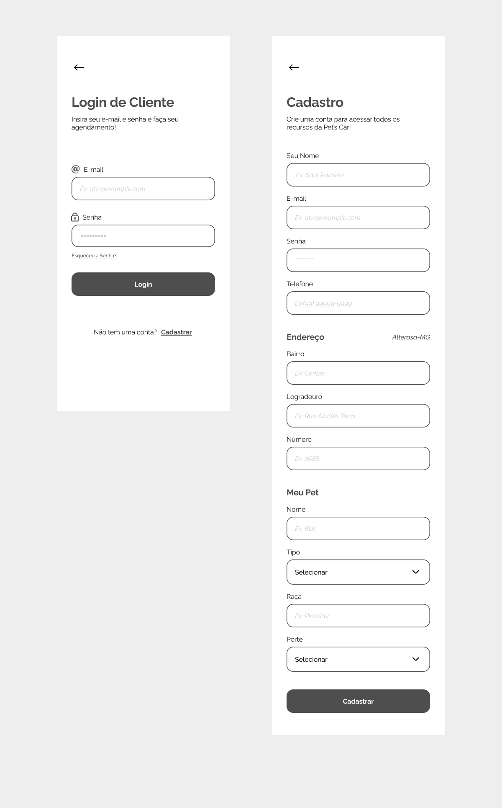
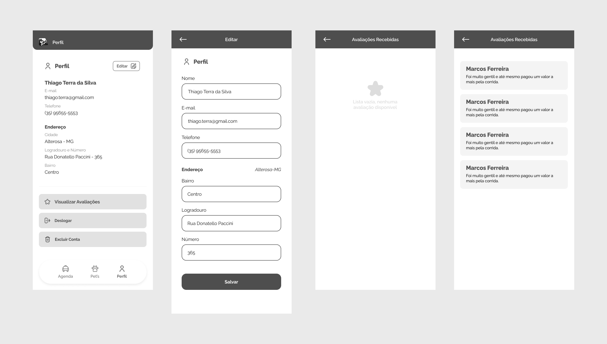
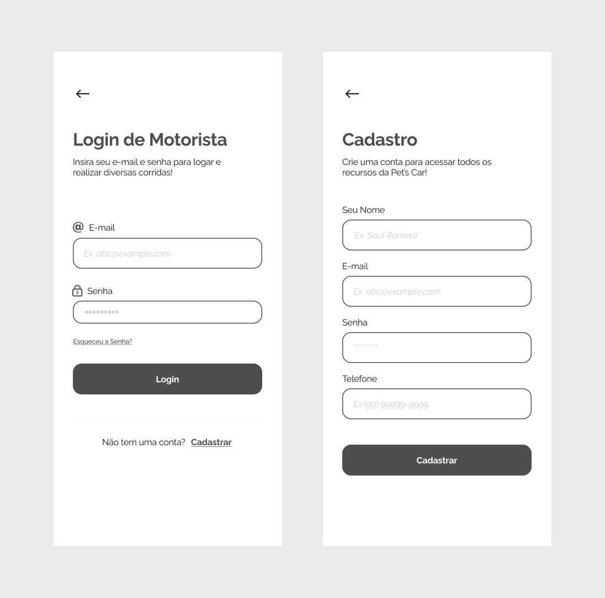
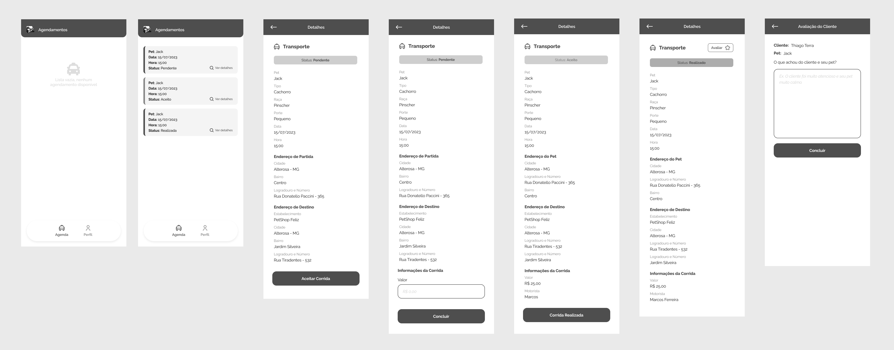
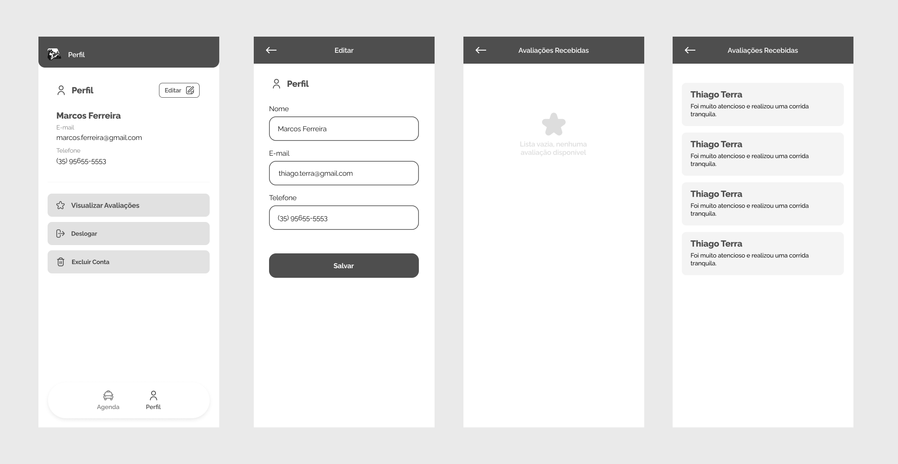

# Projeto de Interface

O detalhamento da interface do sistema levou em consideração questões como acessibilidade, usabilidade e agilidade. Assim sendo, o projeto possui uma identidade padronizada em todas as telas e foram projetadas para permitir a navegabilidade em dispositivos móveis.

## Diagrama de Fluxo

No diagrama de fluxo apresentado a seguir, demonstramos com detalhes o fluxo para cada ação desejada pelo Cliente e Motorista após realizar o login na aplicação.

## Wireframes

Cada uma das telas representadas nos fluxos será detalhada nos itens que seguem. [Clicando aqui](https://www.figma.com/file/RUaNZ9sLa6RtcGo8K9Oydg/Pet'sCar-App?node-id=0-1&t=ZwKxjBOXfmCKvr7e-0), é possível acessar o Wireframe criado na plataforma Figma.

- Tela Inicial

- Telas de Login e Cadastro do Cliente

- Telas de Agendamento do Cliente

- Telas de Pets do Cliente

- Telas de Perfil do Cliente

- Tela de Login e Cadastro do Motorista

- Telas de Agendamento do Motorista

- Telas de Perfil do Motorista

- Telas de Recuperação de Senha

