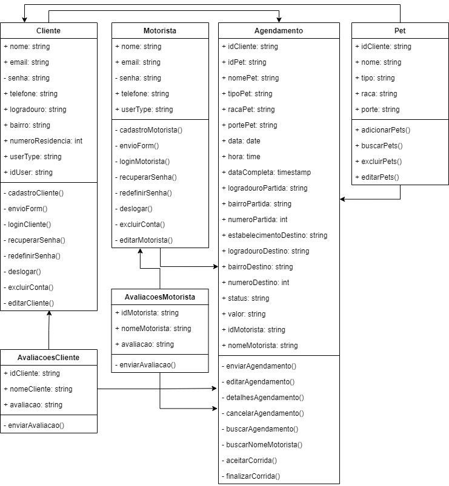
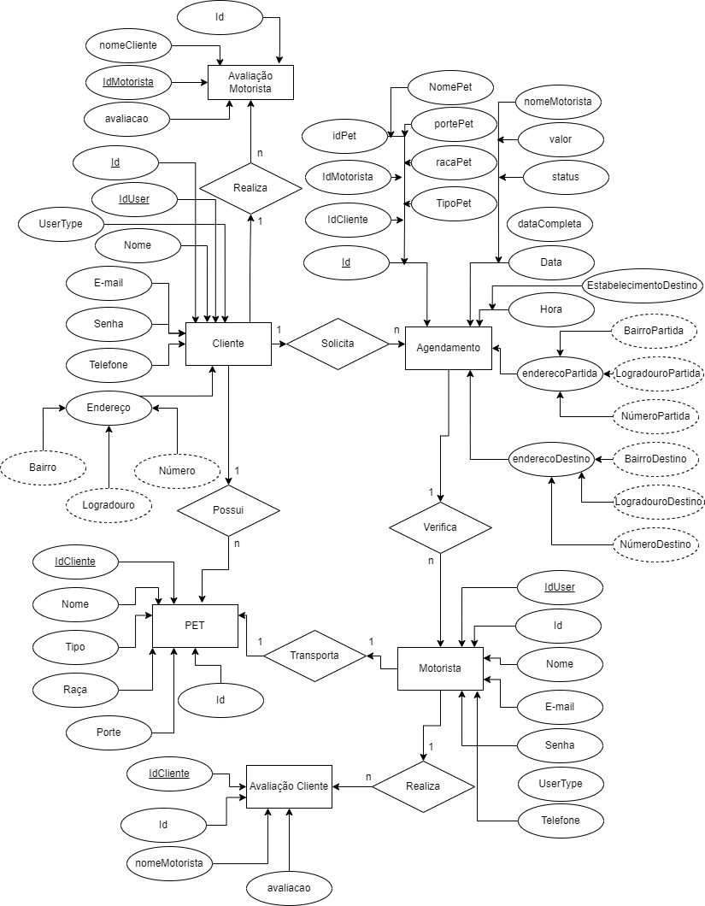
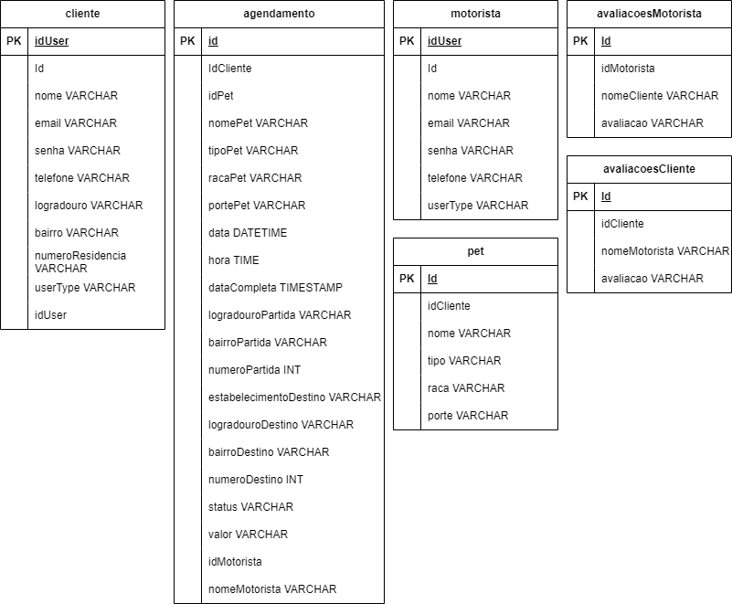
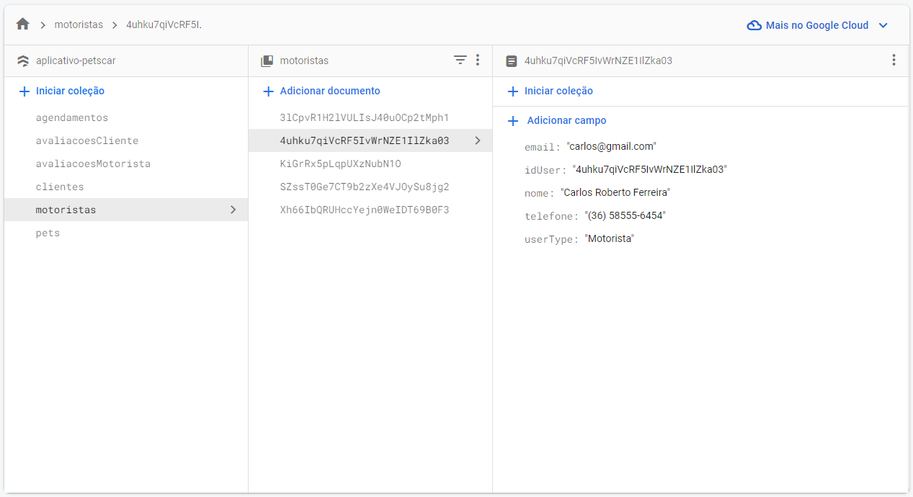

# Arquitetura da Solução

A Arquitetura de Soluções desenha e implementa recursos e ferramentas de TI para atender as necessidades do negócio. No caso da nossa aplicação, Pet’s Car, iremos tratar o desenvolvimento de uma aplicação voltada para o sistema Android.

O nosso código será armazenado no GitHub para que o processo de desenvolvimento seja facilmente acompanhado ou alterado, caso necessário.

Será necessário a utilização de um banco de dados, pois iremos manter as informações dos clientes e motoristas nele, sendo também necessário a utilização da internet, como única forma de comunicação com o servidor e o banco de dados. Sendo caracterizado como arquitetura cliente/servidor. Os dispositivos móveis se caracterizam como Thin Clients, pois dependem da internet, para o acesso ao servidor e ao BD para atualização e obtenção de dados.

A aplicação será desenvolvida como solução para o negócio, sendo um serviço de transporte para animais domésticos. O cliente irá armazenar os seus dados pessoais e os dados do “pet” podendo agendar o melhor horário que estiver disponível no aplicativo para a busca do animal em sua residência pelo motorista. Esse horário escolhido pelo cliente, é disponibilizado pelo motorista dentro do aplicativo, onde ele também irá poderá armazenar os seus dados pessoais.

## Diagrama de Classes

O diagrama de classes ilustra graficamente como será a estrutura do software, e como cada uma das classes da sua estrutura estarão interligadas. Essas classes servem de modelo para materializar os objetos que executarão na memória. 

Abaixo é possível verificar todas as entidades do sistema e seus respectivos atributos, bem como todos os métodos utilizados para implementar as funcionalidades necessárias. 

## Modelo ER

O modelo ER proposta representa através de um diagrama como as entidades do sistema de relacionam entre si na aplicação. Por meio deste também é possível verificar os atributos que cada entidade possui e a cardinalidade entre as relações.

## Esquema Relacional

Para o esquema relacional foram representadas todas as tabelas que serão armazenadas no banco de dados, bem como suas respectivas colunas, chaves e tipo de dados para garantir a integridade de restrições.

## Modelo Físico

Para autenticar usuários e armazenar os dados do aplicativo foi utilizado o Firebase, sendo este um banco de dados NoSQL, que armazena dados em documentos semelhantes a JSON. Um documento é um conjunto de pares chave-valor definidos por um esquema, sendo que um grupo de documentos compõe uma coleção. 

Dessa forma ao fazer a importação do serviço no ambiente de desenvolvimento, obtém-se diversos métodos para consulta, criação de entidades, atualizações, e deletar dados. Para cadastro e login dos usuários no aplicativo também foi utilizado o serviço de autenticação do Firebase, que fornece métodos e APIs para tal finalidade. 

A imagem abaixo representa a organização das coleções e documentos utilizados no aplicativo desenvolvido. 

## Tecnologias Utilizadas

Para o desenvolvimento do projeto Pet’s Car, utilizaremos o VS Code como IDE para a utilização do Expo & React Native, que utiliza o JavaScript como linguagem. Para o banco de dados, utilizaremos o Firebase.

## Hospedagem

Como se trata de aplicativo mobile, após a finalização do desenvolvimento foi utilizado o serviço EAS Build, uma ferramenta desenvolvida pela Expo que permite compilar e construir aplicativos React Native, a conclusão desse processo resultou em dois executáveis, um .ipa (Extensão de aplicativos para IoS) e um .apk (Extensão de aplicativos para Android). 

## Qualidade de Software

- O que é qualidade de software?

Para ajudar nessa questão, a International Organization Standardization - ISO e a International Electrotechnical Comission-IEC, que são organismos normalizadores com importância internacional reconhecida no setor de software, se uniram para editar normas internacionais conjuntas. A norma internacional ISO/IEC, define qualidade de software como a totalidade de características de um produto de software que lhe confere a capacidade de satisfazer necessidades explícitas e implícitas.

Necessidades explícitas são aquelas definidas no requisito proposto. Esses requisitos devem definir as condições em que o produto deve ser utilizado e dizer seus objetivos, funções e desempenho esperado. São, portanto, fatores relativos à qualidade do processo do desenvolvimento do produto que são percebidos somente pelas pessoas que trabalharam no seu desenvolvimento.

Necessidades implícitas são aquelas que, embora não expressas no documento do produtor, são necessárias para o usuário. Estão englobados em esta classe os requisitos que não precisam ser declarados por serem óbvios, mas que pela gravidade de suas consequências devem ser levados em consideração.

Já o grau da qualidade é resultante do conjunto de requisitos do produto e da dificuldade para sua execução. Portanto, deve ser avaliada na definição do escopo. Já a qualidade com seus padrões, processos, controles e direcionamentos normalmente é descrita na política de qualidade.

A norma internacional ISO/IEC 25010, que é uma atualização da ISO/IEC 9126, define oito características e 30 subcaracterísticas de qualidade para produtos de software.

- O que são as Métricas?

As métricas são parte do nosso esforço de medir um software. São perguntas focadas no objeto de interesse do que se deseja medir, acompanhadas de uma escala quantitativa de valores a serem utilizadas e interpretadas por um avaliador. São utilizadas para a caracterização e melhor entendimento sobre a maneira de como os processos, os produtos, os recursos os métodos e as técnicas de desenvolvi-me no de software estão relacionadas.

- Processo de avaliação

O propósito do nosso processo de avalição, se dá com o objetivo de mensurar, com o foco, na a usabilidade, funcionalidade e segurança da aplicação, pra ambos os usuários: cliente e motorista. Para o aplicativo Pet’s Car, iremos utilizar as métricas acima pertencentes as suas respectivas características/subcaracterísticas. As métricas implícitas, serão avaliadas por uma das pesonas do projeto, Criatiane, uma das usuárias ideais do sistema, e as métricas explícitas serão avaliadas pela gerencia de qualidade.
